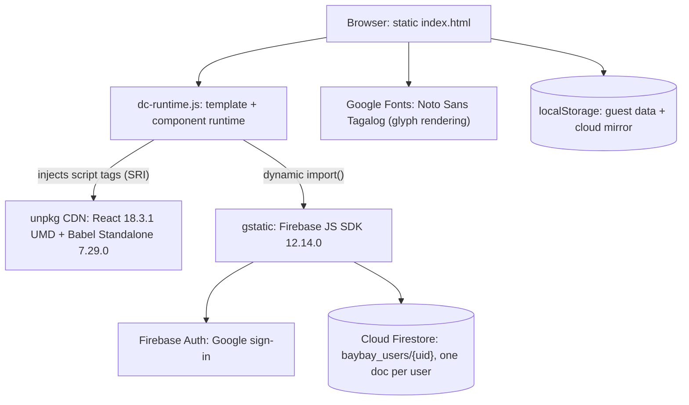

# Baybayin

A flashcard app for learning Baybayin, the pre-colonial writing system of the Philippines. Same Duolingo-style loop as its sibling apps: flashcard practice and a multiple choice quiz with hearts, combos, and a streak, with missed characters pulled into a focused review set. Works as a guest on the device, or syncs across devices with Google sign-in.

**Live demo: https://baybayin.clayborne.dev** (no account needed to try it).

Baybayin is one of three apps on a shared engine. The siblings are [Kanade](https://kanade.clayborne.dev) for the Japanese kana and [Kazu](https://kazu.clayborne.dev) for Japanese numbers. Kanade was built first and Baybayin follows its structure closely; what makes this one different is the script it teaches, which forces two things the others do not need: a font for characters most devices cannot display, and speech that reads romanization because no engine can voice the glyphs. This README covers Baybayin specifically and the shared engine underneath it.

<!-- SCREENSHOT / DEMO GIF GOES HERE -->
> **Demo placeholder:** add a screenshot of the character chart and a GIF of a practice session.

## What it teaches

Baybayin is an abugida, so a consonant carries a built-in vowel and small marks change it. The 59 characters are organized into 5 parts that follow that structure:

- **Vowels, 3.** The standalone ᜀ (a), ᜁ (i, also e), ᜂ (u, also o).
- **Basic consonants, 14.** Each consonant with its inherent `a`: ᜃ (ka), ᜄ (ga), ᜅ (nga), ᜆ (ta), ᜇ (da, also ra), and so on through ᜑ (ha).
- **Kudlit i, 14.** The same consonants with a mark above, which shifts the vowel to i or e: ᜃᜒ (ki) through ᜑᜒ (hi).
- **Kudlit u, 14.** The mark below, shifting to u or o: ᜃᜓ (ku) through ᜑᜓ (hu).
- **Virama, 14.** A cross-shaped mark that removes the vowel entirely and leaves the bare consonant: ᜃ᜔ (k) through ᜑ᜔ (h).

So one consonant like ᜃ gives ka, ki, ku, or k depending on the mark. Each card has the glyph, its romanization, a Korean gloss shown only in Korean mode, and an optional note for alternate readings (ᜇ can be da or ra, the i vowel can be e, the u vowel can be o). You can quiz glyph to reading, reading to glyph, or a random mix, and the chart lets you switch between a glyph view and a reading view.

## Two things this script forces

Everything else is the shared engine. These two are specific to Baybayin.

- **It needs a font.** Baybayin glyphs live in the Unicode Tagalog block (U+1700), which most systems have no font for, so without help they render as empty boxes. The app loads Noto Sans Tagalog from Google Fonts and puts it into every font stack in the template, so the glyphs show up on any device.
- **Speech reads the romanization.** No text-to-speech engine can pronounce a Baybayin glyph, so the app speaks the romanized syllable instead. It asks for a Filipino voice (`fil-PH`, falling back to any `fil` or `tl` voice), and when the device has no Filipino voice at all it lets the default voice read the romanization. That is the honest ceiling here: on many phones the pronunciation is approximate.

## Architecture

There is no server of my own. The app is static files, and Firebase is the only backend.



Nothing is bundled in the deploy path. `dc-runtime.js` is prebuilt and checked in, React and Babel Standalone load from unpkg at runtime, and the Firebase SDK loads from gstatic through a dynamic `import()`. Deploying an update is a `git pull` with no build and no restart.

`dc-runtime.js` is a small runtime compiled from TypeScript. It parses the `<x-dc>` template and a `DCLogic` component class out of `index.html` and renders them with React. The template has its own directives (`sc-if`, `sc-for`, `{{ }}` interpolation, and a `style-active` pressed state), and the component is a plain React-style lifecycle with a `renderVals()` method that builds the view model. The character data and strings live in `baybay-duo-data.js`, exposed as `window.__BAYBAY_DATA`. The runtime file is byte for byte identical to the one in Kanade and Kazu.

## Accounts and sync

The design goal was that a returning signed-in user never sees a loading screen, and that guest and cloud data cross over cleanly.

- **Guest mode** keeps the profile in `localStorage` and writes on every change. It is fully functional on its own.
- **Cloud mode** stores the profile as a single Firestore document at `baybay_users/{uid}`. Sign-in is Google through Firebase Auth, `signInWithPopup` with a `signInWithRedirect` fallback when popups are blocked.
- **Boot is mirror first.** A returning cloud user reaches home immediately from a `localStorage` mirror, before Firestore answers, then the app reconciles in the background: the Firestore local cache first, then the server copy under a timeout.
- **First sign-in promotes the device's guest records** into the new cloud document, and the nickname becomes the Google display name. Signing out returns you to the untouched guest profile.
- **Account-switch guard.** If the on-device mirror belongs to a different user id than the account that just signed in, the mirror is discarded, so one account's progress cannot leak into another's document.
- **Writes are debounced 2 seconds** and merged (`setDoc` with `merge: true`), then flushed on tab hide, page unload, and session end. Offline writes queue in the SDK's persistent local cache. Firestore uses forced long polling and a single-tab persistent cache to keep working where streaming is blocked.

Baybayin and its siblings share the Firebase project but keep separate collections (`baybay_users/{uid}` here), so the apps' records never mix.

## Game mechanics

- **Practice** flips a card, you mark whether you knew it, and missed cards are saved for a one-tap retry.
- **Quiz** gives six choices (keys 1 through 6 work), building five distractors while avoiding duplicate romanizations. Five hearts per session; a wrong answer costs one and running out ends the session. A combo counter tracks correct runs and saves your best. Hard mode adds a per-question timer of 3, 5, or 7 seconds.
- **Review** gathers any character seen at least 3 times with an error rate of 30% or higher, worst first.
- **My Page** has a 17-week activity heatmap in the GitHub style, totals, accuracy, days studied, the streak, and a per-character error grid colored from green to red.
- **Sound effects** are synthesized with the Web Audio API, so there are no audio files. They can be turned off.
- **Keyboard:** Space or Enter reveals and advances in practice, X marks "didn't know," 1 through 6 answer the quiz.

## Tech stack

**Frontend:** static HTML, CSS, and JavaScript. UI authored as an `<x-dc>` template plus a `DCLogic` class, rendered by `dc-runtime.js`. React 18.3.1 (UMD) and Babel Standalone 7.29.0 from unpkg, with Babel compiling the component script in the browser. Light and dark themes in CSS custom properties, auto-detected and toggleable. Brand color indigo `#5B54E8`, with a separate `--err` red for wrong answers. Fonts Jua and M PLUS Rounded 1c, plus Noto Sans Tagalog for the glyphs, all from Google Fonts.

**Auth and data:** Firebase JS SDK 12.14.0 from gstatic. Google sign-in and Cloud Firestore, project `japanese-site-a0af9`, collection `baybay_users`, document `baybay_users/{uid}`. The Firebase web config in the client is public by design; access is governed by Firestore security rules.

**Speech:** the Web Speech API (`SpeechSynthesis`), voice `fil-PH` with a `fil`/`tl` fallback, speaking the romanized syllable.

**Language:** Korean and English UI, Korean by default with browser-language detection on first visit.

### localStorage keys

| Key | Purpose |
|---|---|
| `baybay-duo-guest` | Guest study profile (nick, per-character stats, activity, best combo) |
| `baybay-duo-cloud` | Local mirror of the signed-in profile for instant boot |
| `baybay-duo-mode` | `guest` or `cloud`, decides the entry path next visit |
| `baybay-duo-setup` | Study settings (parts, question direction, hard mode, time limit) |
| `baybay-duo-lang` / `baybay-duo-theme` / `baybay-duo-sound` | UI preferences |

On first run the app imports any legacy `baybay-guest` records read only, so earlier history carries over without being written back.

## Running locally

Static files, so any static server works:

```bash
cd baybayin
python3 -m http.server 8000
# open http://localhost:8000
```

It needs internet for the CDNs (React and Babel from unpkg, Firebase from gstatic, fonts including Noto Sans Tagalog from Google). Google sign-in only works from an authorized domain, so locally you use guest mode, which exercises everything except cloud sync. In production the app is served by Caddy as static files on a shared EC2 instance, alongside an earlier single-file version of the app kept in the repo.

## Known limitations

- **No automated tests.**
- **Pronunciation is approximate on most devices.** Baybayin glyphs cannot be voiced, so the app reads the romanization, and few devices ship a Filipino voice, so it often falls back to a default voice.
- **The glyphs depend on Noto Sans Tagalog loading.** If Google Fonts is unreachable, a device without a Baybayin font shows empty boxes.
- **React and Babel load from unpkg and compile in the browser.** Convenient (no build) but it ships a compiler to the client and makes cold start depend on unpkg. A build step would remove both.
- **The whole profile is one Firestore document,** read and written as a single blob. Fine at this size.
- **Review is a threshold rule** (seen count and error rate), not a spaced-repetition schedule.

## The family

Baybayin, Kanade, and Kazu are the same engine with different data and theming. The runtime file is identical across all three; each app ships its own data module, colors, Firestore collection, and storage prefix.

| App | Teaches | Cards | Brand color | Firestore | TTS |
|---|---|---|---|---|---|
| [Kanade](https://kanade.clayborne.dev) | Hiragana and katakana | 208 | Red `#E0483E` | `users/{uid}` | `ja-JP` |
| [Kazu](https://kazu.clayborne.dev) | Japanese numbers, counters, dates | 270 | Teal `#12A79E` | `kazu/{uid}` | `ja-JP` |
| **Baybayin** | Baybayin script | 59 | Indigo `#5B54E8` | `baybay_users/{uid}` | `fil-PH` |

Repositories: [kanade](https://github.com/ClayborneYeounjunLee/kanade) · [kazu](https://github.com/ClayborneYeounjunLee/kazu) · [baybayin](https://github.com/ClayborneYeounjunLee/baybayin)
